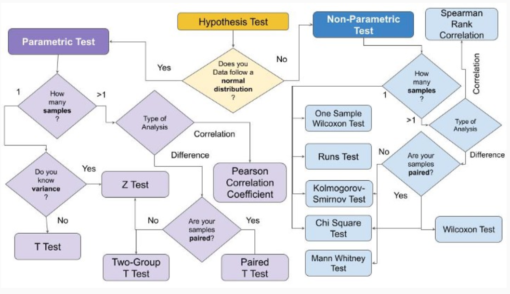

# AB_Testing_Combined_Knowledges

AB testing, also known as split testing or bucket testing, is a method used in marketing, product development, and other fields to compare two versions of a product or service to determine which one performs better. The two versions, typically labeled A and B, are shown to similar groups of users or customers, and their responses are compared to assess which version yields better outcomes.

Here are some key components and definitions related to AB testing:
1) Control Group (A): The control group, often labeled as Group A, represents the current version or the existing standard. It is the baseline against which the experimental variation (Group B) is compared.
2) Variation Group (B): The variation group, labeled as Group B, is the version that includes changes or modifications being tested against the control group. It typically involves alterations in design, content, layout, or any other aspect relevant to the experiment's objectives.
3) Randomization: Randomization is a crucial aspect of AB testing to ensure that the groups are comparable and that any differences in outcomes can be attributed to the variations being tested rather than other factors. Random assignment helps mitigate bias and ensures the validity of the results.
4) Hypothesis: In AB testing, a hypothesis is formulated to articulate the expected outcome of the experiment. It typically consists of a null hypothesis (H0) stating that there is no significant difference between the control and variation groups, and an alternative hypothesis (H1) suggesting that there is a significant difference favoring one group over the other.
5) Hypothesis Testing: Hypothesis testing is a statistical method used to evaluate the validity of a hypothesis based on sample data. In AB testing, hypothesis testing is employed to determine whether the observed differences in performance metrics between the control and variation groups are statistically significant or if they could have occurred by random chance.
6) Statistical Significance: Statistical significance indicates the likelihood that the observed differences between the control and variation groups are not due to random variation but rather reflect true differences in performance. It is typically determined using statistical tests such as t-tests, chi-square tests, or z-tests, with a significance level (alpha) set in advance (commonly 0.05).

## In my first way, I will apply the knowledge of:
- Normality testing with Shapiro-Wilk test, a statistical test used to assess the normality of a dataset
- The Levene test is to assess the homogeneity of variances between two groups
- The Mann-Whitney U test is to conduct a non-parametric test to compare the distributions of two independent samples
- Parametric Test (If Normal)
- Non-Parametric Test (If Not Normal)

In my second way, I will apply the completed step-by-step process for A/B Testing:
- Probability: in which I will examine the data cleaning process, remove outliers, examine some analysis about the control and treatment group in our data 
- A/B Testing:
1. Assume under the null hypothesis, 𝑝𝑛𝑒𝑤 and 𝑝𝑜𝑙𝑑
2. Use 5% Type I error rate
3. Create sample to perform sampling distribution to show differences
4. Compare results of hypothesis test with statsmodels.api z-test.
- Regression Approach:
1. Fit a regression model to see if there is a significant difference in feature based
2. Find p-value and determine if value supports the null hypothesis or rejects the null in support of the alternative hypothesis.
3. Add additional data, e.g. country data, to see if any impact is made on results.

